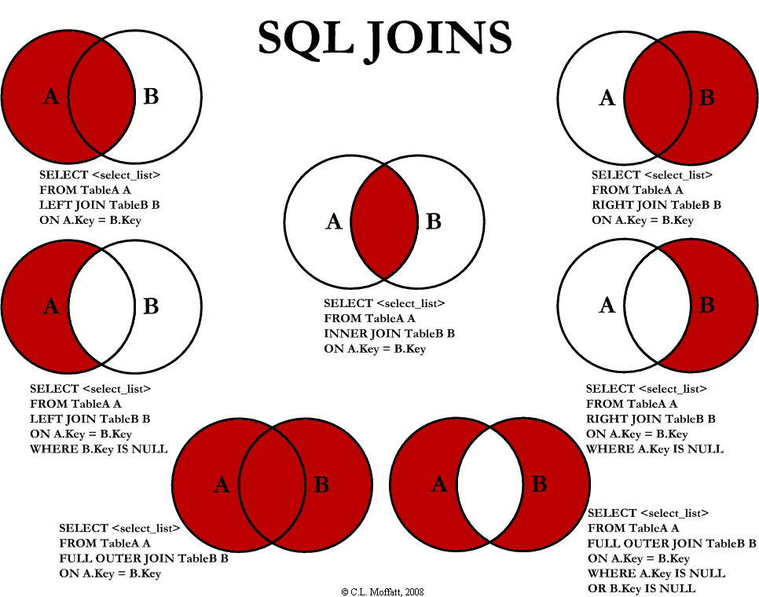

# SQL JOIN #

 

## INNER JOIN ##
The `INNER JOIN` keyword selects records that have matching values in both tables.

-   Syntax:
    -   SELECT `column_name(s)`
        FROM `table1`
        INNER JOIN `table2`
        ON `table1.column_name = table2.column_name`;
## LEFT JOIN ##
The `LEFT JOIN` keyword returns all records from the left table (table1), and the matching records from the right table (table2). The result is 0 records from the right side, if there is no match.
-   Syntax:
    -   SELECT `column_name(s)`
        FROM `table1`
        LEFT JOIN `table2`
        ON `table1.column_name = table2.column_name`;
## RIGHT JOIN ##
The `RIGHT JOIN` keyword returns all records from the right table (table2), and the matching records from the left table (table1). The result is 0 records from the left side, if there is no match.

-   Syntax:
    -   SELECT `column_name(s)`
        FROM `table1`
        RIGHT JOIN `table2`
        ON `table1.column_name = table2.column_name`;

## FULL JOIN ##
The `FULL OUTER JOIN` keyword returns all records when there is a match in left (table1) or right (table2) table records.
`FULL OUTER JOIN` and `FULL JOIN` are the same.

-   Syntax:
    -   SELECT `column_name(s)`
        FROM `table1`
        FULL OUTER JOIN `table2`
        ON `table1.column_name = table2.column_name`
        WHERE `condition`;

The result is 0 records if left(right) table doesn't exist

## SEFT JOIN ##

A self join is a regular join, but the table is joined with itself.

