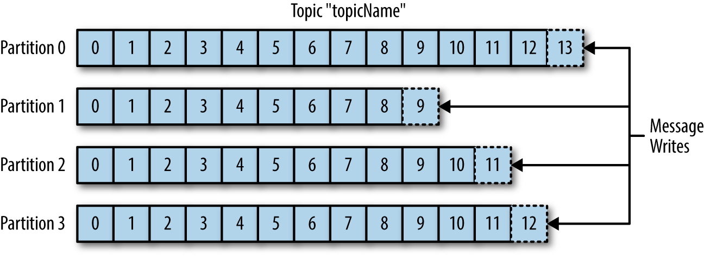
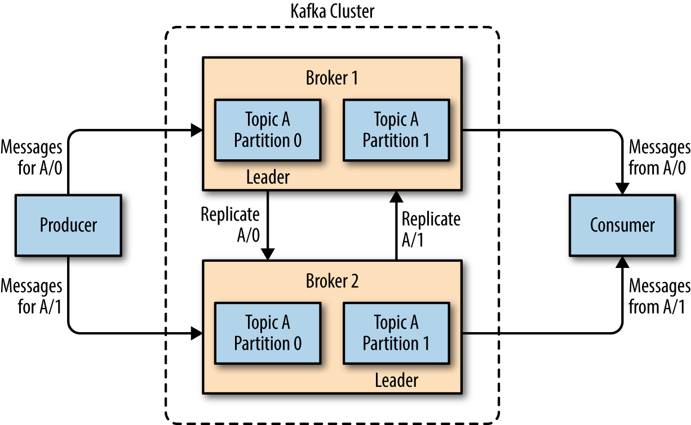
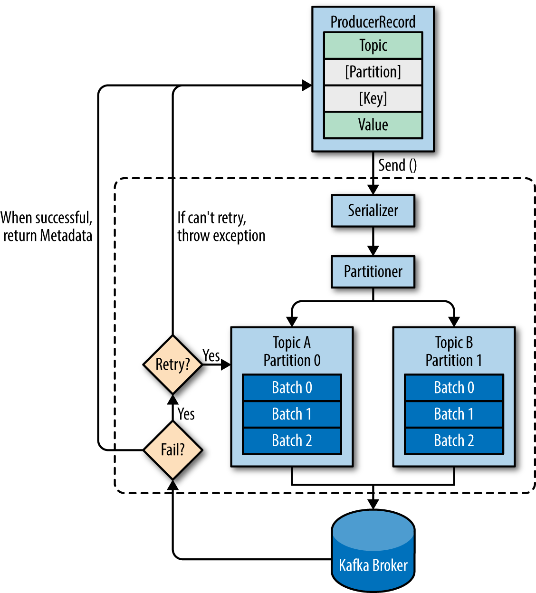
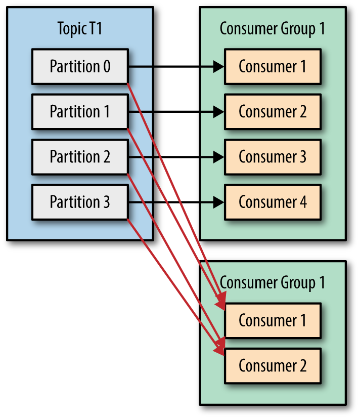

# Kafka

## 1. Topic and partitions

Messages in Kafka are categorized into topics. Topics is like a database table (Message sent in topic should be the same type)

Each topic have multiple partitions. Config in <i><b>num.partitions parameter</b></i>. 

Messages in topic is not time-ordering

Each partition can be hosted in the different server (Leader on 1 server and follower in another) => provides redundancy
and scalability

## 2. Brokers and Clusters

A single Kafka server is called a broker. The broker receives messages from producers,
assigns offsets to them, and commits the messages to storage on disk.

## 3. Kafka producer

KafkaProducer publish the ProducerRecord(Topic, [partition], [key], value) to broker.
If partition == NULL => the partitioner will choose a partition for us, usually based
on the ProducerRecord key.

When the broker receives the messages, it sends back a response. If the messages  were successfully written to Kafka, it will return a RecordMetadata object with the topic, partition, and the offset of the record within the partition.

If the broker failed to write the messages, it will return an error. When the producer receives an error, it  may retry sending the message a few more times before giving up and returning an  error.

We can declare ProducerRecord to send message sync or async

## 4. Kafka consumer

Consumer is used to read message in kafka topic. 
To consume fast, we can use kafka consumer group. 
Each consumer in group can read in 1 or more partition but each partition is read by exactly 1 consumer in group.
=> the maximum number of consumer = number partitions of topic.
If number of consumer > number of partition, some consumers will do nothing

If we have 2 application must receive message in topic, we can create 2 consumer group to consume message

When a consumer join or leave group, reassignment of partitions to consumers also happen => rebalance
During a rebalance, consumer can't consume message. In addition, when partitions are moved from one consumer to another, the consumer loses its current state; if it was caching any data, it will need to refresh its caches 

<i>Note: Different with subscriber in RabbitMq. Kafka consumer is configured to pull message in partition (<b>fetch.max.wait.ms</b>). When send request to kafka => Heartbeats are sent to consumer poll.
If the consumer stops sending heartbeats for long enough => rebalance </i>

To consume message, KafkaConsumer call API : poll()

Whenever we call function poll(), it returns records written to Kafka that consumers in our group have not read yet.
In ordered to track which records were read by a consumer of the group. Kafka partition use <i><b>offset</b></i> to mark position.
We call the action of updating the current position in the partition a commit .

There are 3 way to commit:
#### 1.Automatic Commit:

set enable.auto.commit=true

commit the largest offset your client received from poll()

#### 2.Commit Current Offset

set auto.commit.offset=false

commit the latest offset returned by poll() and  return once the offset is committed, throwing an exception if commit fails for some  reason.

#### 3.Asynchronous Commit

Instead of waiting for the broker to respond to a commit, we just send the request and continue on

If the process is failed. it will not retry.

