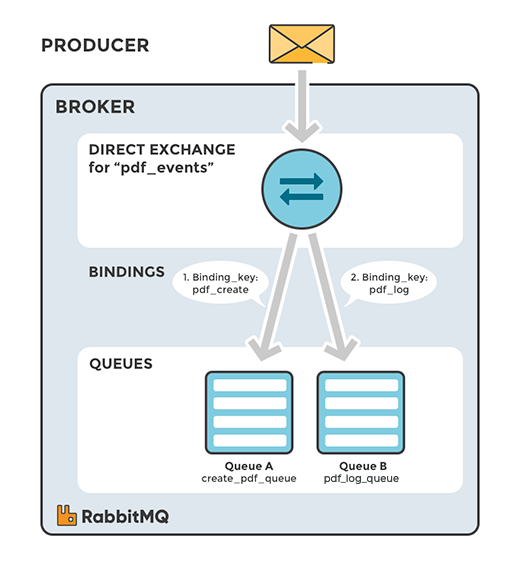
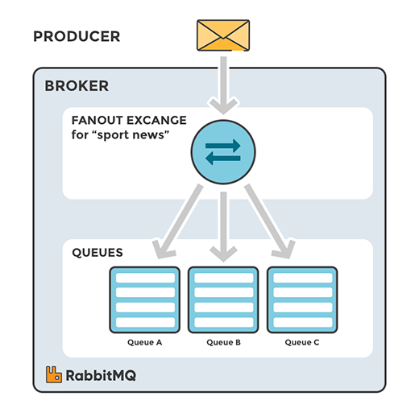
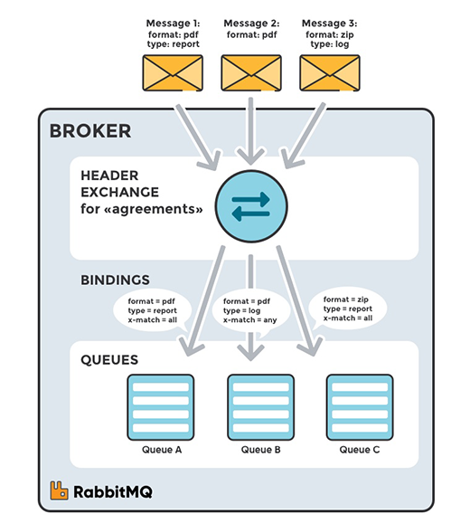

# Rabbit Mq #

## 1. Basic concepts

- Producer: Application that sends the messages
- Consumer: Application that receives the message
- Queue: Buffer that stores messages
- Message: Information that is sent from the producer to a consumer through RabbitMQ
- Connection: A TCP connection between your application and the RabbitMQ broker
- Channel: A virtual connection inside a connection. When publishing or consuming message from a queue - it's all done over a channel
- Exchange: Receives messages from producers and pushes them to queues depending on rules defined by the exchange type. To receive messages, a queue needs to be bound to at least one exchange
- Binding: A binding is a link between a queue and an exchange
- Routing key: A key that exchange looks at to decide how to route the message to queues. Think of the routing key like an address for the message
- AMQP: Advanced Message Queuing Protocol is the protocol used by RabbitMQ for messaging
- Users: It is possible to connect to RabbitMQ with a given username and password. Every user can be assigned permissions such as rights to read, write and configure privileges within the instance. Users can also be assigned permissions for specific virtual hosts.
- Vhost, virtual host: Provides a way to segregate applications using the same RabbitMQ instance. Different users can have different permissions to different vhost and queues and exchanges can be created, so they only exist in one vhost.

## 2. Exhanges
Messages are not published directly to a queue, instead, the producer sends messages to an exchange. An exchange is responsible for routing the message to different queue with the help of bindings and routing keys.
A binding is a link between a queue and an exchange

### Type of exchange

#### Direct exchange: 
A direct exchange delivers messages to queue based on a message routing key. The routing key is a message attribute added to the message header by the producer. Think of the routing ket as an "address" that the exchange is using to decide how to route the message.<b> A message goes to the queue with the binding key that exactly matches the routing key of the message</b>

The direct exchange type is useful to distinguish messages published to the same exchange using a simple string identifier 

#### Default exchange:

The default exchange is a pre-declared direct exchange with no name, usually referred by an empty string. When you use default exchange your message is delivered to the queue with a name equal to the routing key of the message. Every queue is automatically bound to the default exchange with a routing key which is the same as the queue name

#### Topic Exchange:
Topic exchanges route messages to queues based on wildcard matches between the routing key and the routing pattern, which is specified by the queue binding. Messages are routed to one or many queues based on a matching between a message routing key and this pattern.

The routing key must be a list of words, delimited by a period (.). Examples are agreements.us and agreements.eu.stockholm which in this case identifies agreements that are set up for a company with offices in lots of different locations. The routing patterns may contain an asterisk (“*”) to match a word in a specific position of the routing key (e.g., a routing pattern of "agreements.*.*.b.*" only match routing keys where the first word is "agreements" and the fourth word is "b"). A pound symbol (“#”) indicates a match of zero or more words (e.g., a routing pattern of "agreements.eu.berlin.#" matches any routing keys beginning with "agreements.eu.berlin").

The consumers indicate which topics they are interested in (like subscribing to a feed for an individual tag). The consumer creates a queue and sets up a binding with a given routing pattern to the exchange. All messages with a routing key that match the routing pattern are routed to the queue and stay there until the consumer consumes the message.

The default exchange AMQP brokers must provide for the topic exchange is "amq.topic".

##### SCENARIO 1
The image to the right shows an example where consumer A is interested in all the agreements in Berlin.

- Exchange: agreements
- Queue A: berlin_agreements
- Routing pattern between exchange (agreements) and Queue A (berlin_agreements): agreements.eu.berlin.#
- Example of message routing key that matches: agreements.eu.berlin and agreements.eu.berlin.headstore

##### SCENARIO 2
Consumer B is interested in all the agreements.

- Exchange: agreements
- Queue B: all_agreements
- Routing pattern between exchange (agreements) and Queue B (all_agreements): agreements.#
- Example of message routing key that matches: agreements.eu.berlin and agreements.us

##### SCENARIO 3
Consumer C is interested in all agreements for European head stores.

- Exchange: agreements
- Queue C: headstore_agreements
- Routing pattern between exchange (agreements) and Queue C (headstore_agreements): agreements.eu.*.headstore
- Example of message routing keys that will match: agreements.eu.berlin.headstore and agreements.eu.stockholm.headstore

#### Fanout exchange:

A fanout exchange copies and routes a received message to all queues that are bound to it regardless of routing keys or pattern matching as with direct and topic exchanges. The keys provided will simply be ignored.

Fanout exchanges can be useful when the same message needs to be sent to one or more queues with consumers who may process the same message in different ways.

The image to the right (Fanout Exchange) shows an example where a message received by the exchange is copied and routed to all three queues bound to the exchange. It could be sport or weather updates that should be sent out to each connected mobile device when something happens, for instance.

The default exchange AMQP brokers must provide for the topic exchange is "amq.fanout".

##### SCENARIO 1
- Exchange: sport_news
- Queue A: Mobile client queue A
- Binding: Binding between the exchange (sport_news) and Queue A (Mobile client queue A)

A message is sent to the exchange sport_news. The message is routed to all queues (Queue A, Queue B, Queue C) because all queues are bound to the exchange. Provided routing keys are ignored.

#### Headers Exchange:
A headers exchange routes messages based on arguments containing headers and optional values. Headers exchanges are very similar to topic exchanges, but route messages based on header values instead of routing keys. A message matches if the value of the header equals the value specified upon binding.

A special argument named "x-match", added in the binding between exchange and queue, specifies if all headers must match or just one. Either any common header between the message and the binding count as a match, or all the headers referenced in the binding need to be present in the message for it to match. The "x-match" property can have two different values: "any" or "all", where "all" is the default value. A value of "all" means all header pairs (key, value) must match, while value of "any" means at least one of the header pairs must match. Headers can be constructed using a wider range of data types, integer or hash for example, instead of a string. The headers exchange type (used with the binding argument "any") is useful for directing messages which contain a subset of known (unordered) criteria.

EXAMPLE
- Exchange: Binding to Queue A with arguments (key = value): format = pdf, type = report, x-match = all
- Exchange: Binding to Queue B with arguments (key = value): format = pdf, type = log, x-match = any
- Exchange: Binding to Queue C with arguments (key = value): format = zip, type = report, x-match = all

##### SCENARIO 1
Message 1 is published to the exchange with header arguments (key = value): "format = pdf", "type = report".

Message 1 is delivered to Queue A because all key/value pairs match, and Queue B since "format = pdf" is a match (binding rule set to "x-match =any").

##### SCENARIO 2
Message 2 is published to the exchange with header arguments of (key = value): "format = pdf".

Message 2 is only delivered to Queue B. Because the binding of Queue A requires both "format = pdf" and "type = report" while Queue B is configured to match any key-value pair (x-match = any) as long as either "format = pdf" or "type = log" is present.

##### SCENARIO 3
Message 3 is published to the exchange with header arguments of (key = value): "format = zip", "type = log".

Message 3 is delivered to Queue B since its binding indicates that it accepts messages with the key-value pair "type = log", it doesn't mind that "format = zip" since "x-match = any".

Queue C doesn't receive any of the messages since its binding is configured to match all of the headers ("x-match = all") with "format = zip", "type = pdf". No message in this example lives up to these criterias.

It's worth noting that in a header exchange, the actual order of the key-value pairs in the message is irrelevant.